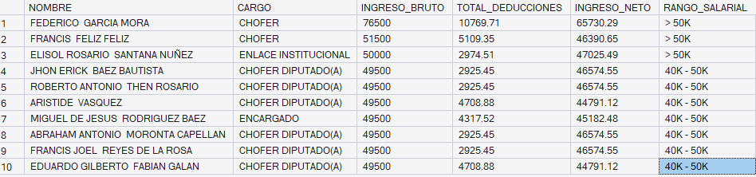
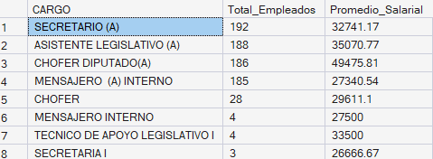

# 📊 ETL & Extracción de Datos Gubernamentales
### Nómina de Empleados – Cámara de Diputados, República Dominicana

---

## 📋 Descripción del Proyecto

Proceso ETL completo aplicado a la nómina pública de empleados de libre nombramiento y remoción de la **Cámara de Diputados de la República Dominicana**, correspondiente a **Junio 2025**.

El objetivo fue extraer, limpiar y transformar los datos para generar información útil sobre la distribución salarial, deducciones y estructura organizacional de la institución.

---

## 🛠️ Tecnologías Utilizadas

| Herramienta | Uso |
|-------------|-----|
| Python (pandas) | Extracción del archivo Excel e importación a SQL Server |
| SQLAlchemy + pyodbc | Conexión entre Python y SQL Server |
| SQL Server (SSMS) | Limpieza, transformación y análisis de datos |
| VS Code | Entorno de desarrollo |

---

## 🔄 Proceso ETL

### 1. Extract — Extracción
- Fuente: Archivo `.xlsx` de nómina pública (datos abiertos gubernamentales)
- Lectura del archivo con `pandas`, saltando las filas de encabezado institucional
- Carga directa a SQL Server mediante `SQLAlchemy`

```python
import pandas as pd
from sqlalchemy import create_engine

df = pd.read_excel('NOMINA-EMPLEADOS-LIBRE-NOMBRAMIENTO-Y-REMOCION-JUNIO-2025.xlsx', header=3)
df.columns = ['NOMBRE', 'DEPARTAMENTO', 'CARGO', 'INGRESO_BRUTO', 'ISR', 'AFP', 'SFS', 'INGRESO_NETO']

engine = create_engine('mssql+pyodbc://localhost/CamaraDeDip?driver=ODBC+Driver+17+for+SQL+Server&trusted_connection=yes')
df.to_sql('Nomina_Junio_2025', con=engine, if_exists='replace', index=False)
```

---

### 2. Transform — Transformación y Limpieza (SQL)

Consultas aplicadas para limpiar y enriquecer los datos:

```sql
-- Total de empleados
SELECT COUNT(*) AS Total_Empleados FROM Nomina_Junio_2025;

-- Cargos más comunes
SELECT CARGO, COUNT(*) AS Total
FROM Nomina_Junio_2025
GROUP BY CARGO
ORDER BY Total DESC;

-- Masa salarial total
SELECT 
    SUM(INGRESO_BRUTO) AS Total_Bruto,
    SUM(ISR)           AS Total_ISR,
    SUM(AFP)           AS Total_AFP,
    SUM(SFS)           AS Total_SFS,
    SUM(INGRESO_NETO)  AS Total_Neto
FROM Nomina_Junio_2025;

-- Distribución por rango salarial
SELECT 
    CASE 
        WHEN INGRESO_BRUTO < 20000 THEN '< 20K'
        WHEN INGRESO_BRUTO < 30000 THEN '20K - 30K'
        WHEN INGRESO_BRUTO < 40000 THEN '30K - 40K'
        WHEN INGRESO_BRUTO < 50000 THEN '40K - 50K'
        ELSE '> 50K'
    END AS Rango_Salarial,
    COUNT(*) AS Empleados
FROM Nomina_Junio_2025
GROUP BY 
    CASE 
        WHEN INGRESO_BRUTO < 20000 THEN '< 20K'
        WHEN INGRESO_BRUTO < 30000 THEN '20K - 30K'
        WHEN INGRESO_BRUTO < 40000 THEN '30K - 40K'
        WHEN INGRESO_BRUTO < 50000 THEN '40K - 50K'
        ELSE '> 50K'
    END
ORDER BY MIN(INGRESO_BRUTO);
```

---

### 3. Load — Vista Final Enriquecida

Se creó una vista en SQL Server con columnas derivadas para análisis:

```sql
CREATE VIEW V_Resumen_Nomina AS
SELECT
    NOMBRE,
    CARGO,
    DEPARTAMENTO,
    INGRESO_BRUTO,
    ISR, AFP, SFS,
    INGRESO_NETO,
    ROUND(ISR + AFP + SFS, 2) AS TOTAL_DEDUCCIONES,
    ROUND(((ISR + AFP + SFS) / INGRESO_BRUTO) * 100, 2) AS PCT_DEDUCCION,
    CASE 
        WHEN INGRESO_BRUTO < 20000 THEN '< 20K'
        WHEN INGRESO_BRUTO < 30000 THEN '20K - 30K'
        WHEN INGRESO_BRUTO < 40000 THEN '30K - 40K'
        WHEN INGRESO_BRUTO < 50000 THEN '40K - 50K'
        ELSE '> 50K'
    END AS RANGO_SALARIAL
FROM Nomina_Junio_2025;
```

---

## 📈 Hallazgos Principales

| Indicador | Resultado |
|-----------|-----------|
| Total de empleados | 821 |
| Cargo más común | Secretario/a (192 empleados) |
| Empleado mejor pagado | Federico García Mora — RD$ 76,500 |
| Rango salarial más frecuente | RD$ 30K – 40K (396 empleados) |
| Empleados con sueldo < 20K | 15 |
| Empleados con sueldo > 50K | 3 |
| Departamento con más empleados | Choferes Comisiones Especiales (24) |

---

## 🗂️ Estructura del Proyecto

```
1 - ETL/
├── etl_nomina.py                                          # Script de extracción y carga
├── consultas_nomina.sql                                   # Consultas SQL de análisis
├── NOMINA-EMPLEADOS-LIBRE-NOMBRAMIENTO-Y-REMOCION-JUNIO-2025.xlsx  # Fuente de datos
└── README.md                                              # Documentación
```

---
## 🖼️ Vista Previa

**Vista general de la nómina limpia:**



**Cargos más comunes:**



---
## 👩‍💻 Autora

**Paula Martinez**  
Estudiante de Ingeniería en Ciencia de Datos — UNICDA  
📧 martinezpaula0728@gmail.com  
📍 Santo Domingo, República Dominicana
